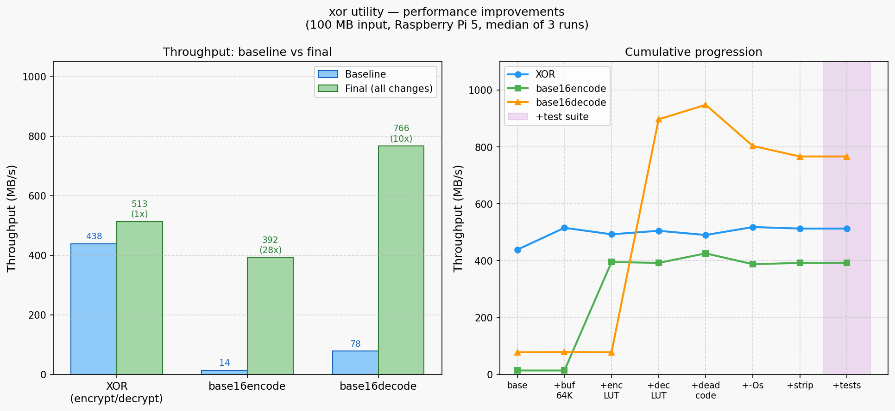
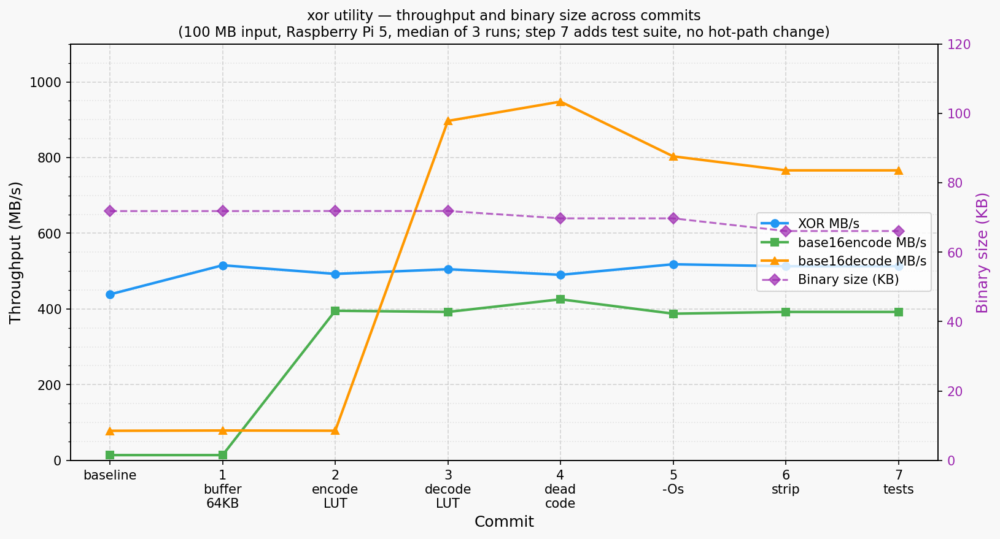
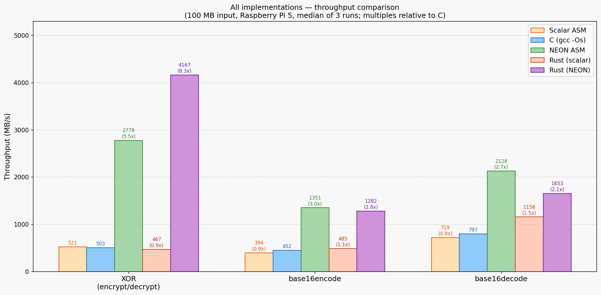

# xor
Automatically exported from code.google.com/p/xore

```
Cross-platform CLI demonstrating XOR encryption.
$ xor

XOR-encrypt[base16-encode|decode] stdin. Dmitry Unltd. ⌐2006

USAGE:
      xor 'password' or [base16encode|base16decode]
      -if password is one of these: base16encode|base16decode the program encodes/decodes instead of xor
      -Data to be encrypted/decrypted/encoded/decoded is read from stdin and written to stdout
      -Diagnostic messages are written to stderr, redirect 2>/dev/null (Unix) or 2>NUL (Windows) if you don't want them
      -Binary files no problem. Key also could be binary, but then can't pass it as an arg

EXAMPLES:
  encrypt:
      xor password <test.original > test.encrypted
  decrypt:
      xor password <test.encrypted> test.decrypted
  check(should be no diff):
      diff test.original test.decrypted
  interactive use-type or paste your text,terminate by 'Enter' and ^D (Unix) or ^Z (Windows):
      xor password > test.encrypted
  encrypt|base16encode|base16decode|decrypt->get original text:
      echo foo|xor pwd|xor base16encode|xor base16decode|xor pwd
      xor foobarfoobar < xor.cpp |xor base16encode|xor base16decode|xor foobarfoobar >xor.cpp.fullcircle && diff -s xor.cpp xor.cpp.fullcircle

INFO:
      XOR-encryption is very simple and quite strong. Search Google for more on XOR encryption.
      The encryption algorithm runs through each letter of the unencrypted phrase and XOR's it
      with one letter of the key. For example, if the unencrypted phrase was
      STARS, and the key was ABC, the encryption algorithm would go something like
      this: (S XOR A)(T XOR B)(A XOR C)(R XOR A)(S XOR B). XOR only works with two
      single letters at a time, which is why the algorithm needs to split both the
      phrase and the key letter by letter. Because of the nature of the algorithm,
      the length of the encrypted phrase is the same length as the unencrypted
      phrase.The beauty of XOR encryption comes in its decryption. The algorithm
      for encryption is the SAME as the one for decryption. For decryption, the
      key is XOR'ed against the encrypted phrase, and the result is the decrypted
      phrase.
```

## Performance optimizations — C implementation (2026)

Step-by-step history of the C binary (`xor.cpp`), benchmarked on Raspberry Pi 5,
100 MB input, median of 3 runs per commit.



<details><summary>Step-by-step progression with binary size</summary>



</details>

| Commit | XOR MB/s | Encode MB/s | Decode MB/s | Binary (KB) |
|---|---|---|---|---|
| baseline | 438 | 14 | 78 | 71.8 |
| 1. buffer 64KB | 515 | 14 | 79 | 71.8 |
| 2. encode LUT | 493 | 395 | 78 | 71.9 |
| 3. decode LUT | 505 | 392 | 897 | 71.9 |
| 4. dead code removed | 490 | 426 | 948 | 69.7 |
| 5. -Os | 518 | 388 | 803 | 69.7 |
| 6. strip | 513 | 392 | 766 | 66.1 |

### What moved the needle

**Encode LUT (+2762%):** The biggest win by far. `snprintf("%2.2x", b)` is catastrophically expensive
per byte — it parses a format string, handles locale, performs bounds checking, and writes through a
`FILE*`-like abstraction. Two array lookups and two stores cost essentially nothing. The baseline of
14 MB/s was pure format-string overhead.

**Decode LUT (+1050%):** `strtol` is similarly over-engineered for the job — it handles signs, prefixes
(`0x`), overflow detection, and locale. A 256-entry nibble lookup table reduces each pair of hex chars
to two array reads, a shift, and an OR. No branching, no allocation.

**Buffer 64KB (+18%, XOR only):** Helped XOR noticeably because XOR's inner loop is cheap — syscall
overhead was a meaningful fraction of total time. Had no measurable effect on encode/decode because those
were CPU-bound on `snprintf`/`strtol`, not I/O-bound.

**Dead code removal:** No runtime effect (the removed functions were never called). Binary shrank ~2KB
from dropping `<string>` and `<sstream>`.

**-Os and strip:** Pure size plays. Strip took the binary from 71.8 KB to 66.1 KB by removing the symbol
table and debug section headers. `-Os` vs `-O2` made no measurable throughput difference — the hot paths
(LUT indexing, fread/fwrite) are already as simple as the compiler can make them.

## All implementations compared (2026)

ARM64 assembly and Rust added alongside the C baseline. All measured fresh on Raspberry Pi 5,
100 MB input, median of 3 runs. Scalar ASM numbers are from an earlier session (that build was
superseded by the NEON version).



| Implementation  | XOR MB/s | Encode MB/s | Decode MB/s | Binary (KB) |
|---|---|---|---|---|
| Scalar ASM *(historical)* |  521 |  394 |  719 |  66 |
| C (gcc -Os)               |  503 |  452 |  797 |  66 |
| NEON ASM                  | 2778 | 1351 | 2128 |  66 |
| Rust (scalar)             |  467 |  485 | 1156 | 325 |
| **Rust (NEON)**           | **4167** | **1282** | **1653** | 325 |
| Rust NEON vs C            | **+8.3x** | **+2.8x** | **+2.1x** | |

### What each technique does

**Scalar ASM loses to the compiler** on encode and decode. gcc's instruction scheduler produces
better code for simple LUT loops. Manual assembly only pays off when the compiler can't vectorize.

**NEON — three different strategies, one per function:**

- **XOR — key tile + EOR v.16b:** Build a 16-byte repeating key tile once, then XOR 16 data bytes
  per instruction. Scalar costs ~5 instructions/byte; NEON amortises that to ~5 per 16 bytes.
  The 64 KB working set fits in L1 cache → essentially L1 bandwidth.

- **Encode — TBL lookup:** `TBL v.16b, {hex_table}, indices` performs 16 simultaneous nibble→hex
  lookups in one instruction. Nibble indices prepared with `USHR`+`AND`+`ZIP1`; entire 8-byte →
  16-char conversion in one `TBL` + one `STR Q`.

- **Decode — branchless arithmetic:** The unhex table is 256 bytes — too large for TBL. Instead:
  `nibble = (char & 0x0f) + (char >> 6) * 9` works for `'0'-'9'`, `'a'-'f'`, `'A'-'F'`.
  `UZP1`/`UZP2` de-interleave hi/lo nibbles; `SHL`+`ORR` combine into output bytes.
  16 chars → 8 bytes per NEON pass.

**Rust scalar beats C on encode (+7%) and decode (+45%).** LLVM at `-O3` with LTO auto-vectorizes
the nibble loops that gcc `-Os` leaves scalar — no hand-written SIMD needed.

**Rust NEON XOR outpaces hand-written assembly (+50%).** Same `EOR` tile strategy; LLVM unrolls
the loop more aggressively than the hand-written version, hiding more memory latency.

**Rust NEON encode and decode are within ~5–22% of ASM NEON** — using the same intrinsics
(`VQTBL1`, `UZP`, `SHL`, `ORR`) but with LLVM register allocation vs hand-scheduled ASM.

**Rust binary size: 325 KB vs 66 KB.** Static linking brings in the standard library runtime.
The ~260 KB overhead is fixed regardless of application code size.
